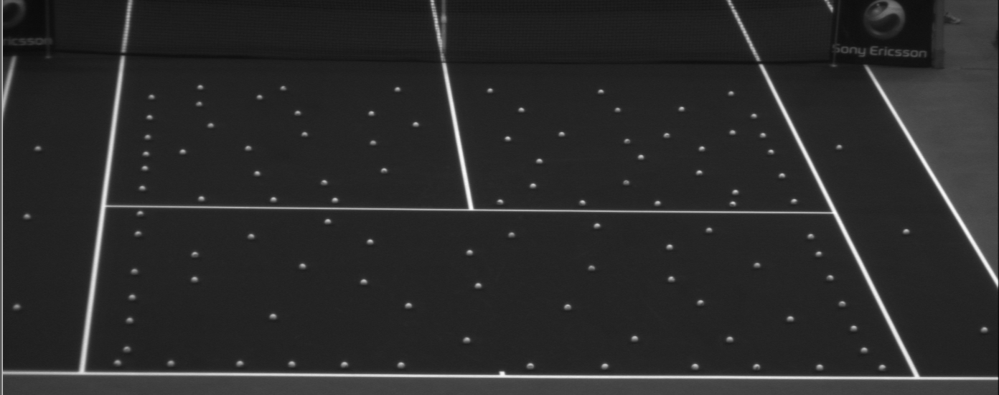
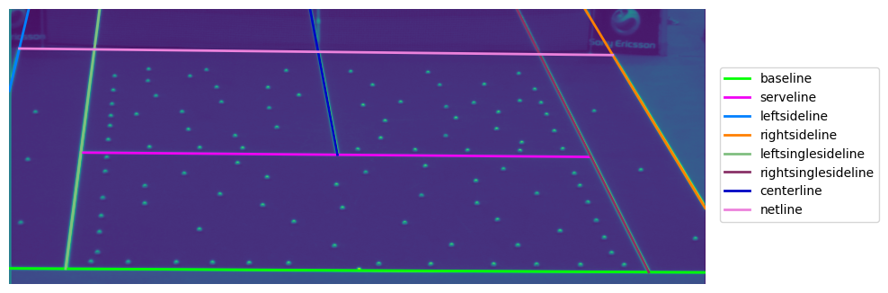

# Hawk-Eye Assigment - a Tennis court lines detector



Provided with a raw image capturing a baseline view of a tennis court, the candidate should
- extract the tennis court lines,
- categorise them given known tennis court dimensions
- and traverse each of them.


## Installation and dependencies

The program has the following dependencies:
- `CMake` for building
- `Boost` for program arguments parsing
- `OpenCV` for image processing functions
- `Eigen` for linear algebra operations

To build the program, run the following:
```bash
mkdir -p build ; cd build ; cmake .. ; make
```


## Usage

Execute with `--help` to see program usage:
```bash
./build/app.exe --help
```

The program creates 8 `.csv` files containing `x` and `y` pixel positions along 8 [tennis court lines](https://en.wikipedia.org/wiki/Tennis_court)
visible from the camera viewpoint.
In addition the program outputs the full **projection matrix** describing the correspondance between image 2D pixel coordinates and 
court 3D world coordinates described in a right-handed coordinates system centered at the intersection between the closest baseline from the cameras
and the left sideline, `x` along the court width, `y` along the court length and using meters for the unit of length.

The `--debug` input flag enables the display of intermediate debugging images.


## Implementation

The `courtdetector` located in `modules` is meant to belong to a large computer vision pipeline
in which modules process multiple consecutive images and deliver their result downstream.
This module **consumes** gray images (8-bits per pixels) and **produces** the associated
calibration data using knowledge of the tennis court dimensions.


## Working hypothesis

The implementation relies on several hypothesis:
- the camera captures half of the tennis court with a baseline view and has low lenses distortion (the code assumes no distortion)
- the service rectangle is fully visible and the service line appears shorter than the besaline below.
- the tennis court dimensions are known and given (defaults to 'ITF')


## Visuals

The calibration enables superimposition of full tennis court lines on the input image:



## Developement process

### Prototyping

The code was prototyped using python, although keeping efficiency in mind (see `prototyping` folder).
To install the python code dependencies, run the following command from the `prototyping` folder:
```bash
pip install -e .
```

An example using the provided raw image is given in the `prototype.ipynb` notebook.
```bash
jupyter notebook prototype.ipynb
```

I initially started by defining a list of operators to extract lines.

I tested different approaches for edge detection ([`CannyEdgeDetection`](src/cv/image_processing.py#L48) and [`LaplacianEdgeDetection`](src/cv/image_processing.py#L59)) but without good enough accuarcy.
I then tried a corner detection approach ([`HarrisCornerDetection`](src/cv/image_processing.py#L71) combined with [`LinesFromPoints`](src/modules/court_detection.py#L168)) but the results were stlightly off.
I finally used a Hough Lines detector ([`SegmentsDetection`](src/cv/image_processing.py#L97)), refining the detected segments with [`ClusterDetectedSegments`](src/modules/court_detection.py#L41), and that produced the best results.

The last part which consists in detecting relevant keypoints and finding the homography was trivial for me as I did it nunmerous time in the past.
Computing the calibratino data brings a lot of advantages like knowing the position of occluded lines, or computing 3D trajectories of objets in the scene (see my latest paper)

### Final implementation

Once the python version was finished, I addressed the translation to C++.

I chose to use `CMake` for building because, although I had no previous experience with it, it is considered a more modern and efficient alternative to `GNU autotools`.
It was also my first experience with `Eigen` as I never had to implement linear algebra operations with C++ before.

## Authors

I developed this library alone during my free time.
